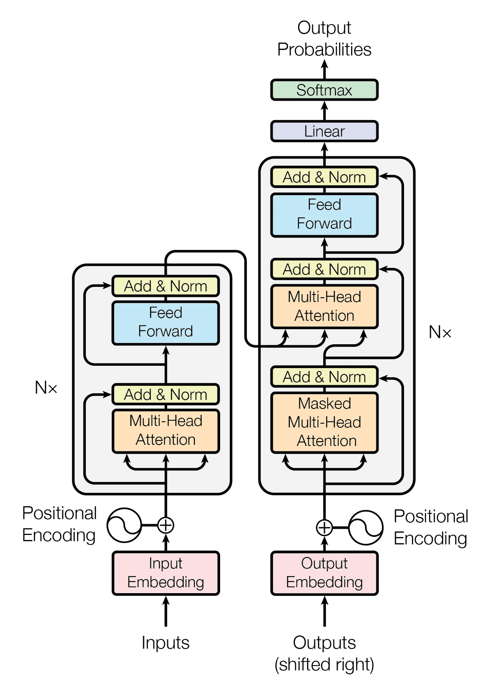
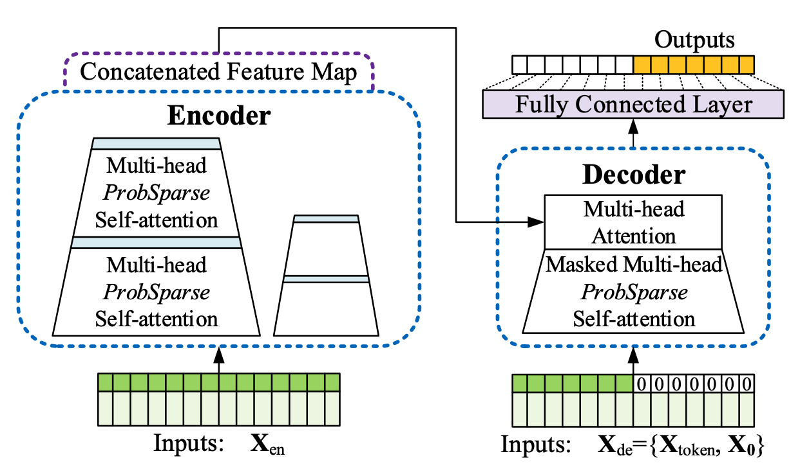
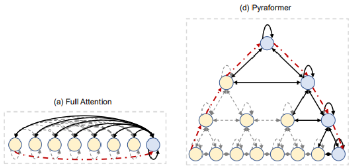

# AI-Powered Algorithmic Trading in Cryptocurrency Markets

## Introduction

Integrating deep learning methods into algorithmic trading systems is revolutionizing the financial industry. It has opened up sophisticated analysis and decision-making capabilities that were once limited to institutional investors, making them accessible to retail investors. However, the application of deep learning in medium-frequency trading (1-30 seconds), especially in the cryptocurrency market, remains largely unexplored.

This research project aims to bridge this gap by investigating the feasibility and effectiveness of integrating deep learning methods into an algorithmic trading system specifically tailored for cryptocurrency trading. [Full Paper Here](docs/documents/Final_Report.pdf)


## Research Objectives

- Explore the application of deep learning methods in medium-frequency cryptocurrency trading.
- Develop a comprehensive full-stack algorithmic trading system.
- Investigate novel transformer architectures, including Informer, Pyraformer, and an enhanced original transformer, for cryptocurrency price prediction.
- Compare the performance of these transformer models with traditional ARIMA models, particularly when operating on larger datasets.
- Integrate predictive signals from these models into a Deep Reinforcement Learning (DRL) framework for effective order generation and decision-making.

## Research Findings
This study explored the feasibility of developing a full-stack algorithmic trading system capable of running deep-learning-based trading strategies on Cryptocurrency limit order book data.

- Transformer models (Informer, Pyraformer, enhanced original transformer) outperformed traditional ARIMA models in capturing intricate patterns in cryptocurrency price data.
- The Pyraformer model exhibited the best performance, showcasing superior predictive accuracy and shorter training and inference times.
- Integrating predictive signals from these models into a Deep Reinforcement Learning (DRL) framework enhanced order generation and decision-making capabilities.
- The algorithmic trading system showed promising results, with potential for further tuning and improvement.

## Methods
Predictive models are a powerful tool for accurately predicting future events or outcomes based on
historical data. With the increasing availability of large and complex datasets, advanced machine-learning
techniques have become essential for extracting meaningful insights and making informed decisions. This
study conducted an extensive literature review to identify a range of predictive models, including the
Transformer, Informer, and Pyraformer. These models have demonstrated impressive performance in
learning complex patterns from historical data and accurately forecasting future trends
### Transformer Models

#### Transformer

The Transformer is a foundational deep learning architecture that has revolutionized natural language processing and time series analysis. In this study, we explored its application to cryptocurrency price forecasting. The Transformer's core components, such as self-attention and multi-head attention, allow it to capture complex patterns in historical data.



#### Informer

Informer is a specialized time-series transformer architecture designed explicitly for forecasting tasks. It addresses some of the limitations of the original Transformer when dealing with long sequences of data. Informer introduces innovative positional encoding techniques and self-attention distillation to improve its performance in capturing temporal dependencies.



#### Pyraformer

Pyraformer is a novel pyramidal attention-based Transformer model tailored for time series data. It aims to efficiently capture long-range dependencies while maintaining low computational complexity. Pyraformer introduces the Coarser-Scale Construction Module (CSCM) and the Pyramidal Attention Module (PAM) to achieve these objectives.



## Ideas for Future Work

In the realm of future work, several key areas can be explored to further enhance the performance and capabilities of algorithmic trading systems:

- Explore the influence of dataset size on the performance of transformer models, including larger datasets spanning durations of 3 or 7 days.
- Investigate the effectiveness of time-series transformers in predicting both high-frequency and long-frequency data to understand their scalability.
- Conduct a comprehensive analysis between transformer models and state-of-the-art LSTM models to determine their strengths and weaknesses.
- Implement sentiment analysis techniques to augment forecasting models by integrating contextual information from social media and news.
- Experiment with different neural network architectures, such as convolutional neural networks (CNNs) and recurrent neural networks (RNNs), for improved prediction capabilities.
- Further enhance the market simulation for more accurate trading environments.
- Ready the trading system for live trading by handling real-time market data feeds and optimizing execution modules.
- Explore the potential for evolving the system into an algorithmic-trading-as-a-service paradigm, particularly if it progresses toward an MLOps level 2 classification and establishes microservice scalability rules.

These directions for future research highlight the potential for continued innovation and improvement in algorithmic cryptocurrency trading.


## Setup

- Setup Commands

  ```
  conda create -n tradeai python=3.8 -y

  conda activate tradeai

  pip install --upgrade pip setuptools wheel

  pip install -r requirements.txt

  sudo apt-get install git-lfs (linux)

  brew install git-lfs (homebrew)

  choco install git-lfs (microsoft)
  ```

- Running TradeAI (locally and in container)

  ```
  ./run_locally.sh
  ```

- Run Client (connecting to local TradeAI)

  ```
  npm install

  npm start
  ```

- Running TradeAI (in azure; extra requirements: docker, docker-compose, az)

  ```
  ./run_in_azure.sh
  ```

- How to use DVC to manage data

  1. Ask to be added to DVC remote repository

  2. dvc pull - should be prompted to login into google account.

  3. Modify data

  4. dvc add [data_file]

  5. Commit changes to [data_file].csv.dvc to git

  6. dvc push
  
